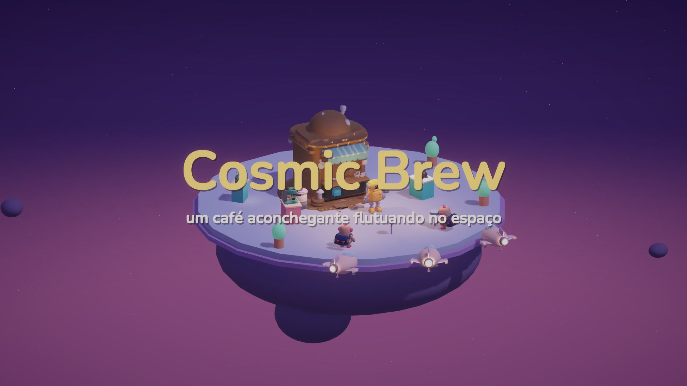
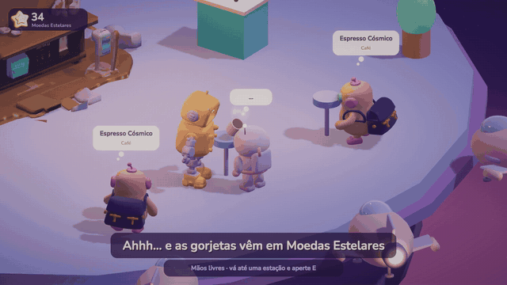
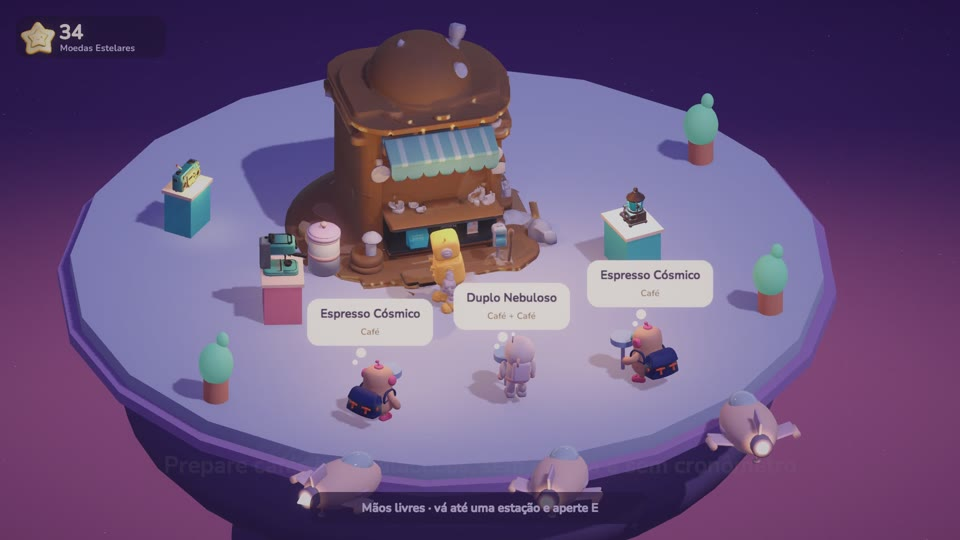
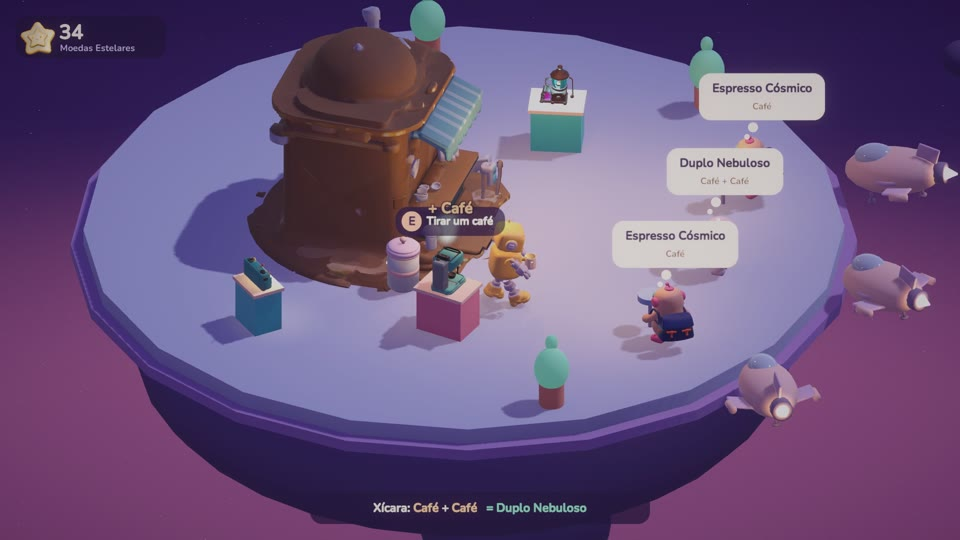
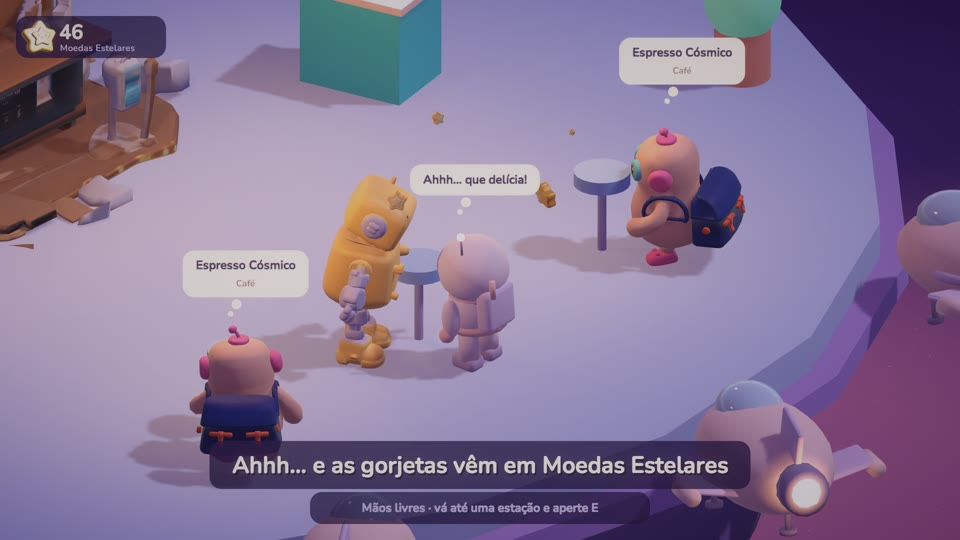
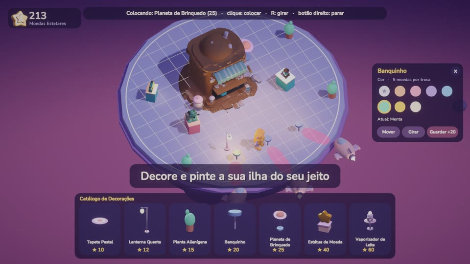

<div align="center">


# Cosmic Brew

**A cozy coffee kiosk floating in space.**

A relaxing low-poly 3D management game: no timers, no penalties, no angry customers.<br>
Just lo-fi beats, intergalactic coffee and a little island to decorate.

[](https://github.com/athedsx/Cosmic-Brew/releases/latest)


[**Download for Windows**](https://github.com/athedsx/Cosmic-Brew/releases/latest) · [Watch the trailer](https://github.com/athedsx/Cosmic-Brew/releases/latest) · [Game design document](Docs/GDD.md)



</div>

## About

You are **R0-B0 ("Ro")**, a retired mining robot who saved up to open a tiny coffee kiosk on a quiet rest route of the cosmos. Travelers dock their little ships at the edge of the island, order through thought bubbles, and Ro prepares every drink at his own pace while a lo-fi radio plays.

<div align="center">

</div>

## Features

- **Zen core loop:** customers arrive by ship, order, and tip in **Star Coins** after a satisfied *"Ahhh…"*.
- **No failure states:** a wrong drink goes in the bin and you simply try again. Nobody ever leaves upset.
- **Six recipes** across three ingredients. Buying the Nebula Milk Steamer unlocks new drinks such as the Lunar Latte and Creamy Galaxy.
- **Click-based Build Mode** on a grid: buy, move, rotate, paint and store decorations, and recolor the deck, rim and kiosk.
- **Varied customers:** aliens, lost astronauts and hovering robots, all bobbing to the beat.
- **Interactive radio:** three original lo-fi tracks and sixteen ASMR-style sound effects.
- **Six languages:** English, Português, Русский, 한국어, 中文 and 日本語.
- **Autosave**, plus audio, video and language options.

## Screenshots

| | |
|---|---|
|  |  |
|  |  |

## Download and install

1. Download **`CosmicBrew-Setup-v1.0.0.exe`** from the [latest release](https://github.com/athedsx/Cosmic-Brew/releases/latest).
2. Run it and follow the setup wizard. No administrator rights are needed.
3. Launch the game from the Start menu or the desktop shortcut. You can uninstall it from *Apps & features*.

> **Windows SmartScreen:** the installer is not code-signed yet, so Windows may show *"Windows protected your PC"*. Click **More info → Run anyway**.

**Requirements:** Windows 10/11 64-bit, a DirectX 11 GPU and about 200 MB of disk space.

## Controls

| Action | Input |
|---|---|
| Move | `W` `A` `S` `D` |
| Brew / serve / interact | `E` or `Space` |
| Build Mode | `B` |
| Select, place, buy (Build Mode) | Left click |
| Rotate / store item | `R` / `X` |
| Deselect / cancel | Right click or `Esc` |
| Rotate camera | `Z` / `C` |
| Zoom | Mouse wheel |
| Music on/off | `M` |
| Pause | `Esc` |

## Building from source

**Prerequisites**

- [Unity 6000.6.1f1](https://unity.com/releases/editor/archive) with Windows Build Support
- [Git LFS](https://git-lfs.com/): models, textures, audio and fonts are stored in LFS

```bash
git lfs install
git clone https://github.com/athedsx/Cosmic-Brew.git
```

Open the project in Unity Hub, load `Assets/Scenes/SampleScene.unity` and press **Play**.

**Player build:** use *File → Build Profiles → Windows → Build* and output to `Builds/Windows`.

**Installer:** install [Inno Setup 6](https://jrsoftware.org/isinfo.php) and run:

```bash
ISCC.exe Tools/installer/CosmicBrew.iss
```

The installer is written to `Builds/installer/`.

## Project structure

```
Assets/
  Scripts/CoreLoop/     Customers, stations, recipes, Build Mode, UI, save, audio, localization
  Scripts/Dev/          Trailer director and automated walk test
  Models/               Character and prop models (Blender-generated ones live in Models/Blender)
  Audio/                Lo-fi music and sound effects (procedurally synthesized)
  Resources/Localization/strings.txt   All in-game text in six languages
Tools/
  blender/              Script that generates low-poly models in Blender (headless)
  trailer/              Assembles the trailer from rendered frames with ffmpeg
  fonts/                Subsets the fonts to the characters actually used
  audio_gen/            Synthesizes the music and sound effects
  installer/            Inno Setup script and installer artwork
site/                   Static download page for the game
Docs/                   Game design document and media
```

### Tooling

| Task | Command |
|---|---|
| Regenerate the Blender models | `blender --background --factory-startup --python Tools/blender/make_models.py -- Assets/Models/Blender` |
| Rebuild the subset fonts after editing `strings.txt` | `python Tools/fonts/build_fonts.py` |
| Render the trailer | Add a `TrailerDirector` component in Play mode, then run `python Tools/trailer/make_trailer.py` (requires `pip install imageio-ffmpeg`) |

**Tech:** Unity 6 · Universal Render Pipeline · Input System · uGUI built in code · JSON save system.

## Credits

- **Game, code and design:** NodeStl
- **Main 3D models:** generated with [Tripo](https://www.tripo3d.ai/). Additional models are procedurally built in Blender.
- **Music and sound effects:** synthesized in code (`Tools/audio_gen`).
- **Fonts:** [Nunito](https://fonts.google.com/specimen/Nunito) and [Noto Sans KR/SC/JP](https://fonts.google.com/noto), licensed under the SIL Open Font License 1.1.

## License

© 2026 NodeStl. All rights reserved. The source is published for reference; please get in touch before reusing assets or code. Third-party fonts keep their own license (SIL OFL 1.1).
